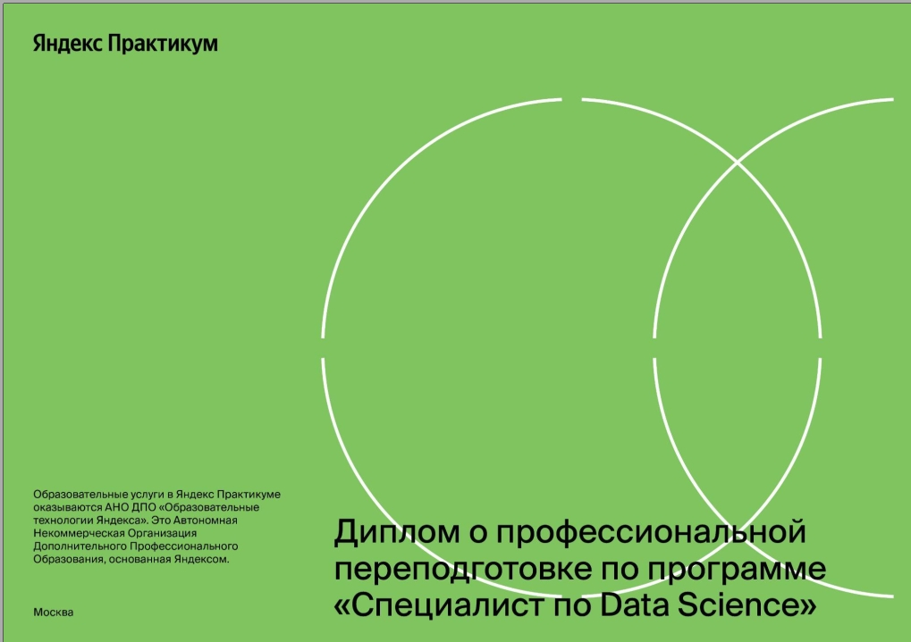
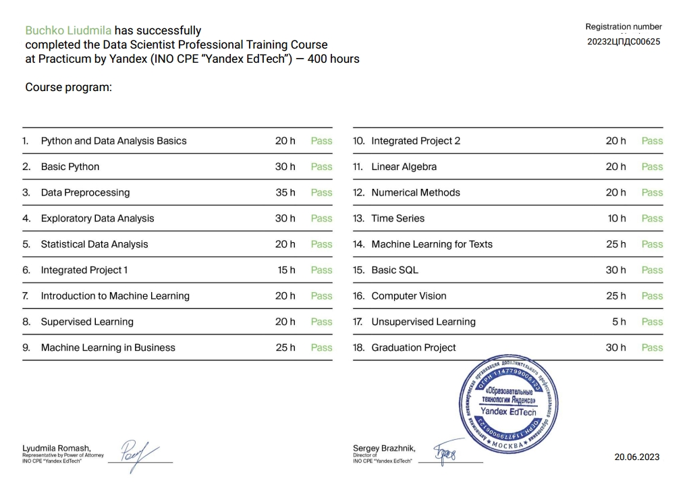
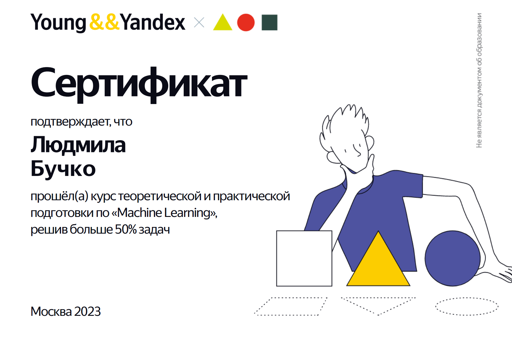

# Data Science Projects

  

The repository contains data science projects
completed by <a href="https://github.com/LydmiLAB">LydmiLAB</a> in the Yandex.Prakticum  course.  

<a href="diplomes/Yandex_Diplom_.jpg">Сertificate of completion of the course</a>

<table>
  <tr>
    <th>Yandex Diplom</th>
    <th style="width:60%;">Yandex Competition Certificat</th>
    <th>Hackaton Certificat Autumn Hack 2023, Glowbyte</th>
  </tr>
   <tr>
    <td></td>
    <td></td>
    <td></td>
  </tr>
   <tr>
    <td></td>
    <td></td>
    <td></td>
  </tr>

<table>
  <tr>
    <th>Project</th>
    <th style="width:60%;">Description</th>
    <th>Libraries and tools</th>
  </tr>

  
   <tr>
    <td><a href="15_client_churn_prediction_telecom">Client Churn Prediction</a></td>
    <td>The operator needs to find users in advance, who plans to refuse services connections, they will offer promotional codes and special conditions. A model has been developed to predict customer churn in order to reduce it and plan an advertising campaign.</td>
    <td>Python, Pandas, numpy, re, datetime, sweetviz, Matplotlib, seaborn, phik, sklearn, catboost, xgboost, lightgbm, optuna, shap, math, tqdm / MinMaxScaler, OneHotEncoder, OrdinalEncoder, OptunaSearchCV, GridSearchCV, RandomizedSearchCV, RandomForestClassifier, LogisticRegression, CatBoostClassifier, XGBClassifier, LGBMClassifier, roc_auc_score, Pipeline</td>
  </tr>

   <tr>
    <td><a href="14_age_recognition_by_photo">Age Recognition System by Photo</a></td>
    <td>A chain supermarket is implementing a computer vision system to process customer photos. A recognition model has been built to determine a person’s age from a photo. The model passed the customer metric threshold. </td>
    <td>Python, Pandas, numpy, Matplotlib, tensorflow, statistics, PIL / ResNet50, ImageDataGenerator, mean_squared_error, Adam,GlobalAveragePooling2D, augmentation, image processing, neural networks</td>
  </tr>

  <tr>
    <td><a href="13_classification_of_comments">Classification of Comments</a></td>
    <td>The online store is launching a new service for users to edit and supplement product descriptions by suggesting edits and comments on changes to others. A comment classification model has been developed to determine their toxicity and moderation. </td>
    <td>Python, Pandas, sklearn, numpy, Matplotlib, datetime, os, pipeline, tqdm, BERT, nltk, transformers, torch / CountVectorizer, TfidfTransformer, BertTokenizer, LogisticRegression, RandomizedSearchCV, BertForSequenceClassification</td>
  </tr>

 <tr>
    <td><a href="12_taxi_order_forecasting">Taxi Order Forecasting </a></td>
    <td>To attract more drivers during peak periods, a model was built to forecast the volume of taxi orders for the next hour. </td>
    <td>Python, sklearn, Pandas, numpy, seaborn, Matplotlib, datetime, os, pipeline, random, statistics, lightgbm, tqdm / heatmap, barplot, Numerical methods, MinMaxScaler, OneHotEncoder, RandomizedSearchCV, TimeSeriesSplit, LGBMRegressor, Ridge, DummyRegressor, time series, regression, predictions</td>
  </tr>

 <tr>
    <td><a href="11_predict_car_price_recommendation_system">Prediction Car Price (Recommendation System) </a></td>
    <td>A car price recommendation model was built for the customer's application. </td>
    <td>Python, sklearn, Pandas, numpy, seaborn, Matplotlib, datetime, os, pipeline, random, statistics, lightgbm, xgboost, tqdm / histogram, heatmap, barplot, gradient boosting, regression, Numerical methods, MinMaxScaler, OneHotEncoder, RandomizedSearchCV, SimpleImputer</td>
  </tr>

 <tr>
    <td><a href="10_data_protection_algorithm_insurance">Insurance Company Data Protection Algorithm </a></td>
    <td>A correct personal data encryption algorithm has been developed.</td>
    <td>Python, sklearn, Pandas, numpy, seaborn, Matplotlib, math, os / histogram, heatmap, pipeline, barplot, MinMaxScaler, linear algebra, matrix, LinearRegression</td>
  </tr>

 <tr>
    <td><a href="09_predicting_gold_rate">Predicting Gold Rate </a></td>
    <td>A model was built to predict the rate of gold extraction from gold ore to reduce the risk of starting an unprofitable enterprise.</td>
    <td>Python, sklearn, Pandas, numpy, seaborn, Matplotlib, datetime, tqdm, bootstrap / histogram, barplot, MinMaxScaler, RandomizedSearchCV, make_scorer, LinearRegression, DecisionTreeRegressor, RandomForestRegressor, DummyRegressor</td>
  </tr>

<tr>
    <td><a href="08_predicting_profitable_oil_regions">Predicting Profitable Oil Regions </a></td>
    <td>A model has been built to determine a profitable oil production region, where oil production will bring the greatest possible profit and the least risk.</td>
    <td>Python, sklearn, Pandas, numpy, seaborn, Matplotlib, datetime, tqdm, bootstrap / histogram, barplot, class imbalance</td>
  </tr>

<tr>
    <td><a href="07_bank_churn_predictions">Bank customer churn forecast prediction </a></td>
    <td>A classification model has been built that predicts whether a bank client will leave.</td>
    <td>Python, sklearn, Pandas, numpy, seaborn, Matplotlib, datetime, tqdm / histogram, barplot, class imbalance</td>
  </tr>

<tr>
    <td><a href="06_tariff_recommendation_system_telecom">Classification model for tariff recommendation system</a></td>
    <td>A classification model has been built that will allow you to select an appropriate tariff.</td>
    <td>Python, sklearn, Pandas, numpy, seaborn, Matplotlib, datetime / histogram, barplot</td>
  </tr>

<tr>
    <td><a href="05_games_sales_analysis_e-commerce">Game Sales Analysis e-commerce</a></td>
    <td>A potentially profitable product for planning advertising campaigns has been identified.</td>
    <td>Python, Pandas, numpy, scipy, seaborn, Matplotlib, datetime / data processing, histogram, barplot, scattermatrix, scatterplot, exploratory data analysis, descriptive statistics, statistical test, Student's t test</td>
  </tr>

<tr>
    <td><a href="04_determining_profitable_tariff_telecom">Determining Profitable Tariff Telecom</a></td>
    <td>Favorable tariffs were found and optimal sets of services for users were recommended that would bring more profit to the company.</td>
    <td>Python, Pandas, numpy, datetime, Matplotlib / data processing, histogram, barplot, scattermatrix, scatterplot, statistical test, Student's t test</td>
  </tr>

<tr>
    <td><a href="03_real_estate_market_analysis">Real Estate Market Analysis</a></td>
    <td>The market value of various types of real estate and typical parameters of apartments were determined depending on the distance from the center.</td>
    <td>Python, Pandas, numpy, Matplotlib / data processing, histogram, boxplot, scattermatrix, scatterplot, categorization, fraud monitoring</td>
  </tr>

  <tr>
    <td><a href="02_bank_loan_risks">Bank Loan Risks</a></td>
    <td>A credit scoring model has been constructed as a system of methods for assessing the borrower’s ability to repay the loan to the bank on time. A portrait of a reliable borrower has been drawn up.</td>
    <td>Python, Pandas, numpy, Sklearn, SciPy, Matplotlib</td>
  </tr>

  <tr>
    <td><a href="01_yandex_music">Yandex Music</a></td>
    <td>EWe studied the data and compared the behavior and preferences of Yandex Music users in two cities by testing hypotheses.</td>
    <td>Python, Pandas, matplotlib </td>
  </tr>
</table>

